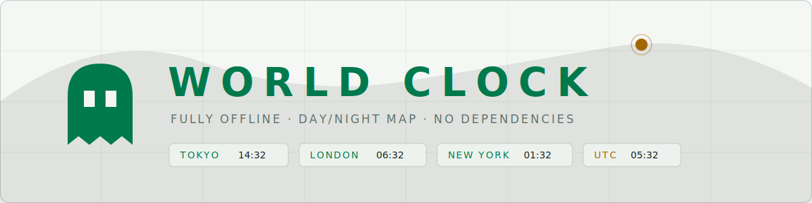
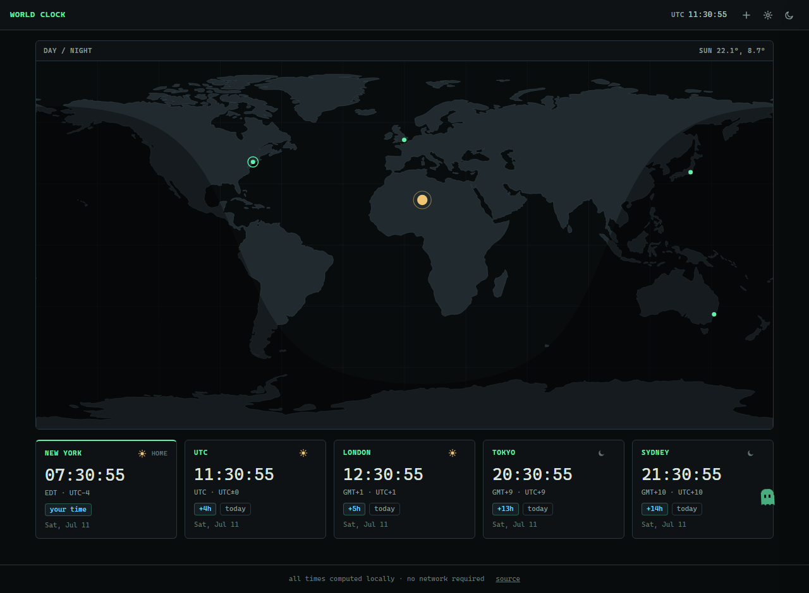

<p align="center">
  <picture>
    <source media="(prefers-color-scheme: dark)" srcset="docs/assets/cover-dark.svg">
    
  </picture>
</p>

<p align="center">
  <a href="https://real-fruit-snacks.github.io/worldclock/"><strong>Live site</strong></a> ·
  <a href="#features">Features</a> ·
  <a href="#run-it">Run it</a> ·
  <a href="#keyboard">Keyboard</a> ·
  <a href="#host-it-yourself">Host it yourself</a> ·
  <a href="#development">Development</a>
</p>

A fully offline world clock. Set your home timezone (or let the browser detect it), pin the cities you care about, and watch the day/night terminator sweep across a live world map. Styled with the
[Terminal Workbench design system](https://github.com/Real-Fruit-Snacks/terminal-workbench-design-system):
calm graphite surfaces, restrained ANSI accents, monospace manifest labels.

**No network. No dependencies. No build step.** Every timezone computation uses the browser's own `Intl` database; the map and city coordinates are committed data. Open `index.html` from a USB stick and it works.



## Features

- **Live day/night map** — equirectangular world map (Natural Earth) with a real solar terminator, the sun drawn at the subsolar point, and a marker for every city you track. Hover a marker to see its time; hover a card to find its marker.
- **Rich clock cards** — big monospace time, timezone abbreviation and UTC offset, offset-from-home chips (`+13h · tomorrow`), date line, and a sun/moon icon computed from actual solar elevation at that city.
- **Home timezone** — auto-detected on first visit, overridable to any IANA zone. Your home card is pinned first; every offset is relative to it.
- **Any timezone** — searchable picker over the browser's full IANA list (~420 zones) with common aliases ("nyc", "beijing", "zulu"), plus a curated suggestions list. Drag cards to reorder; everything persists locally.
- **Settings** — 12/24-hour, show/hide seconds, dark/light/system theme, six accent colors. Each setting is independent and stored in `localStorage` only.
- **The ghost** — a little site pet, ported from [vault](https://github.com/Real-Fruit-Snacks/vault). It drifts, peeks at your cards, naps, and flees the cursor. Click it to recolor it. Cursor-follow and off modes, size/opacity sliders, and per-quirk toggles live in settings.
- **Both themes, themed everywhere** — dark by default, light by preference or toggle; scrollbars, inputs, tooltips, and focus rings all follow the theme.
- **Time scrubber** — drag the slider (or `←`/`→`) to preview any point ±24h from now across every card and the map at once; a RESET button appears whenever you've scrubbed away from the present.
- **Keyboard shortcuts** — press `?` any time for a help overlay listing every shortcut.
- **Card nicknames** — double-click a card's title to rename it; the nickname is saved and shown instead of the city name.
- **Shareable links** — the URL hash always mirrors your current board, so copying the address bar (or the COPY LINK button in settings) hands someone your exact setup.
- **Copy a time** — click any card's time to copy it to the clipboard.
- **Waking-hours bar** — a thin strip on every card tracks that city's local day, with the 9-to-5 working window highlighted and a marker at their local now — "is it business hours there?" at a glance.
- **Kiosk mode** — press `f` to hide the chrome for a clean, wall-display view; `esc` (or `f` again) exits.
- **Installable PWA** — add it to your home screen or desktop; a service worker caches everything on first visit so it keeps working fully offline afterward.
- **Sort by time** — one topbar button reorders every card by current local time.
- **Measure on the map** — drag between any two points; the ends snap to the nearest cities and the time difference rides the line itself, with the dashes flowing toward the later timezone. Draw as many as you like — click a line to remove it, esc clears them all.

## Run it

Open `index.html`. That's it — it works from `file://`, a USB stick, or any static file server.

For a local server:

```
python -m http.server 8000
```

then visit http://localhost:8000.

## Keyboard

Press `?` in the app to bring up this same list at any time.

| Key | Action |
|---|---|
| `/` | search timezones |
| `s` | settings |
| `t` | toggle theme |
| `f` | kiosk mode |
| `← →` | scrub time ±1h (shift: 15m) |
| `n` | back to now |
| `?` | this help |
| `esc` | close / exit |

## Host it yourself

Everything needed to host is in this repository — static files only, no build.

**GitHub Pages:** fork or push this repo, then Settings → Pages → Deploy from branch → `main` / `/ (root)`. The included `.nojekyll` is required (it stops Jekyll from mangling the files).

**GitLab Pages:** the included [`.gitlab-ci.yml`](.gitlab-ci.yml) publishes the site on every push to the default branch — no configuration needed.

**Anything else:** copy `index.html`, `css/`, `js/`, `manifest.webmanifest`, `sw.js`, and `icons/` to any web root.

## Development

- [`tests.html`](tests.html) — dependency-free in-browser test suite (open it; expect `FAIL 0`). Covers offset math, day-relations across the date line, solar declination at solstice/equinox, zone search, prefs round-trips, and a map-geometry regression test.
- `tools/gen_zones.py` — regenerates `js/zones.js` (zone → coordinates) from `tools/reference/zone1970.tab` (IANA tzdb).
- `tools/gen_map.py` — regenerates `js/mapdata.js` from Natural Earth `land-110m` TopoJSON, splitting polygons at the antimeridian so nothing draws across the map seam.

Both generators are one-time tools; their inputs are vendored in `tools/reference/` so regeneration never needs the network either.

## Architecture

| File | Responsibility |
|---|---|
| `js/clocks.js` | time engine (`Intl` only) + card rendering + the 1-second tick |
| `js/map.js` | solar position, terminator, sun and city markers, tooltips |
| `js/settings.js` | preference store (sole `localStorage` owner), settings panel, zone search |
| `js/data.js` | aliases, curated suggestions, zone helpers |
| `js/zones.js`, `js/mapdata.js` | generated data tables (committed) |
| `js/qol.js` | time scrubber, shortcuts, sharing, nicknames, copy, kiosk, ambient title/favicon |
| `js/pet.js` | the ghost |

Plain scripts, one shared `WC` namespace, and four window events (`wc:prefs`, `wc:zones`, `wc:scrub`, `wc:pet`) — no framework, no modules, view-source friendly.

## Credits

- Design tokens: [terminal-workbench-design-system](https://github.com/Real-Fruit-Snacks/terminal-workbench-design-system) (MIT)
- Pet ghost: ported from [vault](https://github.com/Real-Fruit-Snacks/vault) (MIT)
- Land polygons: [Natural Earth](https://www.naturalearthdata.com/) via [world-atlas](https://github.com/topojson/world-atlas) (public domain)
- Zone coordinates: [IANA tz database](https://www.iana.org/time-zones) `zone1970.tab` (public domain)

## License

[MIT](LICENSE)
